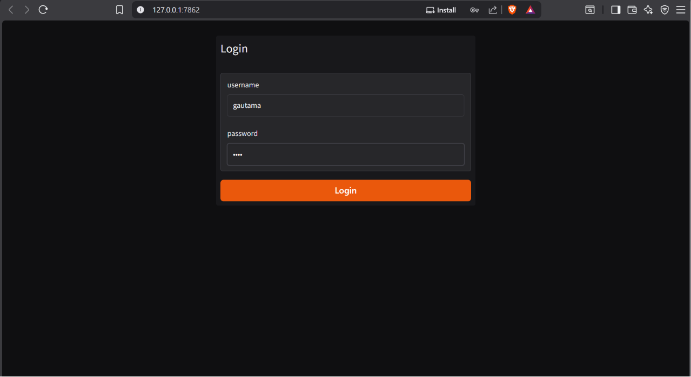
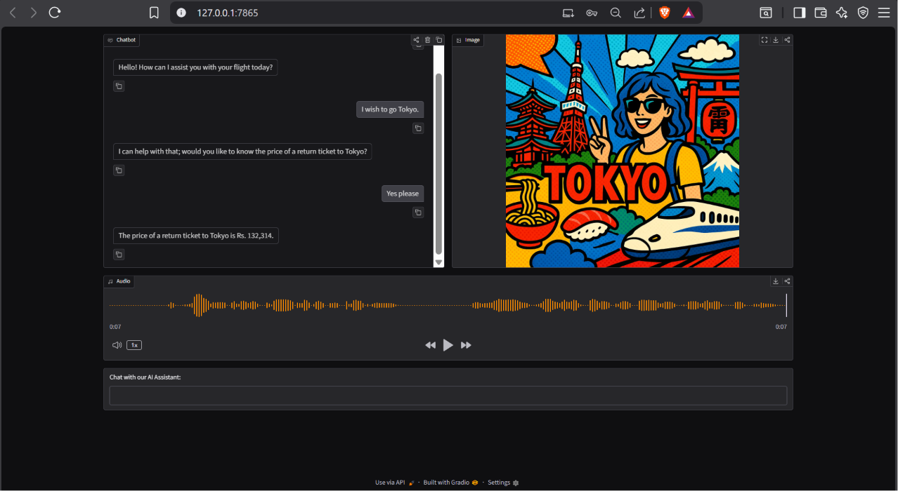

# FlightAI Assistant

FlightAI Assistant is a multimodal airline customer-support assistant built using OpenAI APIs and Gradio.

<!-- ===================================================== -->
<!-- INSERT SCREENSHOTS HERE -->
<!-- ===================================================== -->


### Login Interface



### Interface exam with tts and image genration




<!-- ===================================================== -->

## Overview

The application can:

- Answer airline-related questions
- Retrieve ticket prices through function calling
- Store and retrieve ticket prices from SQLite
- Generate destination-themed images
- Generate spoken responses using OpenAI Text-to-Speech
- Maintain conversational context
- Provide an interactive Gradio interface

This project was built primarily to understand how Large Language Models interact with external tools and how multimodal AI applications are structured.

---

## Features

### Conversational Airline Assistant

Uses OpenAI GPT models to answer user queries in a concise and helpful manner.

### Function Calling

The model can decide when ticket price information is required and automatically invoke Python functions.

### SQLite Database

Ticket prices are stored in a local SQLite database instead of hardcoded logic.

### AI Image Generation

When a destination is discussed, the assistant generates a travel-themed image using OpenAI's image generation model.

### AI Voice Responses

Assistant replies are converted into speech using OpenAI Text-to-Speech.

### Gradio Interface

A web-based interface combining:

- Chat
- Audio
- Images

into a single application.

---

# Architecture

```text
User
 │
 ▼
Gradio Interface
 │
 ▼
OpenAI GPT
 │
 ├──────────────┐
 │              │
 ▼              ▼
Tool Calling    Normal Response
 │
 ▼
SQLite Database
 │
 ▼
Ticket Price
 │
 ▼
GPT Response
 │
 ├───────────┐
 │           │
 ▼           ▼
TTS       Image Generation
 │           │
 ▼           ▼
Audio      Travel Poster
 │           │
 └─────► User ◄─────┘
```

---

# Learning Objectives

This project was created to understand:

- OpenAI Chat Completions API
- Tool Calling / Function Calling
- Structured Tool Definitions
- JSON Argument Parsing
- SQLite Database Integration
- Text-to-Speech APIs
- Image Generation APIs
- Gradio Event Chaining
- Conversation Memory
- Multi-Modal AI Applications

---

# Project Structure

```text
flight-ai/
│
├── flight_ai.ipynb
├── prices.db
├── .env
├── screenshots/
│
├── chat.png
├── tool-calling.png
├── image.png
└── audio.png
```

---

# Code Walkthrough

## 1. Environment Setup

```python
load_dotenv()
openai = OpenAI()
```

### Purpose

Loads the API key from the environment and creates an OpenAI client.

---

## 2. System Prompt

```python
system_message = """
You are a helpful assistant for an Airline called FlightAI.
"""
```

### Purpose

Defines the assistant's personality and behavior.

The model receives these instructions before every conversation.

---

## 3. Basic Chatbot

```python
response = openai.chat.completions.create(
    model=MODEL,
    messages=messages
)
```

### Purpose

Creates a simple conversational chatbot without tools.

This serves as the foundation for the rest of the project.

---

## 4. Streaming Responses

```python
stream = openai.chat.completions.create(
    stream=True
)
```

### Purpose

Streams tokens as they are generated.

Instead of waiting for the complete response, users see text appear gradually.

---

## 5. Tool Function

```python
def get_ticket_price(city):
```

### Purpose

Provides ticket price information for a destination.

The LLM itself cannot access databases.

It must request that Python executes this function.

---

## 6. Tool Definition

```python
price_function = {
    ...
}
```

### Purpose

Describes:

- Tool name
- Parameters
- Parameter types
- Usage instructions

This allows the model to understand how to call the function.

---

## 7. Tool Handler

```python
def handle_tool_call(message):
```

### Purpose

Receives the tool request from the model and executes the corresponding Python function.

Example:

```text
Model:
get_ticket_price("Tokyo")
```

Python:

```text
Ticket price to Tokyo is ...
```

---

## 8. SQLite Integration

```python
sqlite3.connect(DB)
```

### Purpose

Introduces persistent storage.

Instead of storing prices inside dictionaries, ticket prices are saved in a database.

### Database Table

```sql
CREATE TABLE prices (
    city TEXT PRIMARY KEY,
    price REAL
);
```

---

## 9. Database Tool

```python
SELECT price
FROM prices
WHERE city = ?
```

### Purpose

Fetches destination prices directly from SQLite.

This mimics how real-world applications retrieve data.

---

## 10. Image Generation

```python
openai.images.generate(...)
```

### Purpose

Generates destination-themed artwork.

Example:

```text
Paris
```

Produces:

```text
Vacation-style Paris travel artwork
```

---

## 11. Text-to-Speech

```python
openai.audio.speech.create(...)
```

### Purpose

Converts assistant replies into spoken audio.

The user receives both:

- Text response
- Voice response

---

## 12. Multi-Tool Workflow

```python
handle_tool_calls_and_return_cities()
```

### Purpose

Tracks destinations used during tool calls.

The extracted city is later used for:

- Database lookup
- Image generation

---

## 13. Final Chat Pipeline

```python
User Question
      │
      ▼
GPT
      │
      ▼
Tool Call
      │
      ▼
SQLite
      │
      ▼
GPT Response
      │
      ├── Audio
      │
      └── Image
```

This is the core orchestration layer of the application.

---

## 14. Gradio Interface

The final UI combines:

- Chatbot
- Image viewer
- Audio player
- Text input

using Gradio Blocks.

```python
with gr.Blocks():
```

This creates a multimodal interface where a single user query can produce:

- Text
- Audio
- Images

simultaneously.

---

# Example Interaction

### User

```text
What is the ticket price to Paris?
```

### Tool Call

```python
get_ticket_price("Paris")
```

### Database Response

```text
Ticket price to Paris is Rs. 84,964
```

### Assistant

```text
The current ticket price to Paris is Rs. 84,964.
```

### Additional Outputs

- Voice narration of the response
- AI-generated Paris travel artwork

---

# Technologies Used

- Python
- OpenAI API
- GPT-4.1 Mini
- GPT Image Generation
- GPT-4o Mini TTS
- SQLite
- Gradio
- dotenv

---

# Future Improvements

- Real flight APIs
- Flight booking workflows
- Flight cancellation support
- Passenger profiles
- Authentication
- Travel recommendations
- Hotel suggestions
- Multi-city itinerary planning
- RAG-based travel knowledge base

---

# Author

Shivam Gautam

Built as a learning project while exploring:

- OpenAI Function Calling
- Tool Orchestration
- Multimodal AI
- SQLite Integration
- Gradio Applications